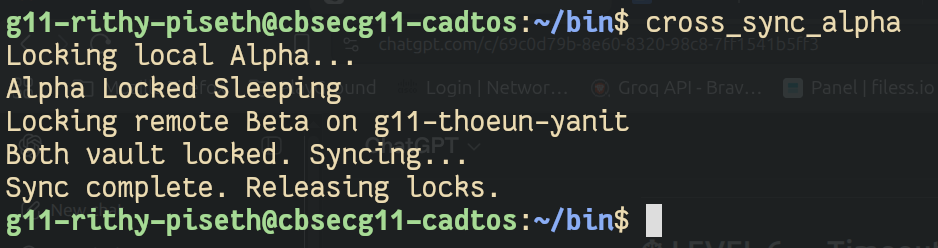
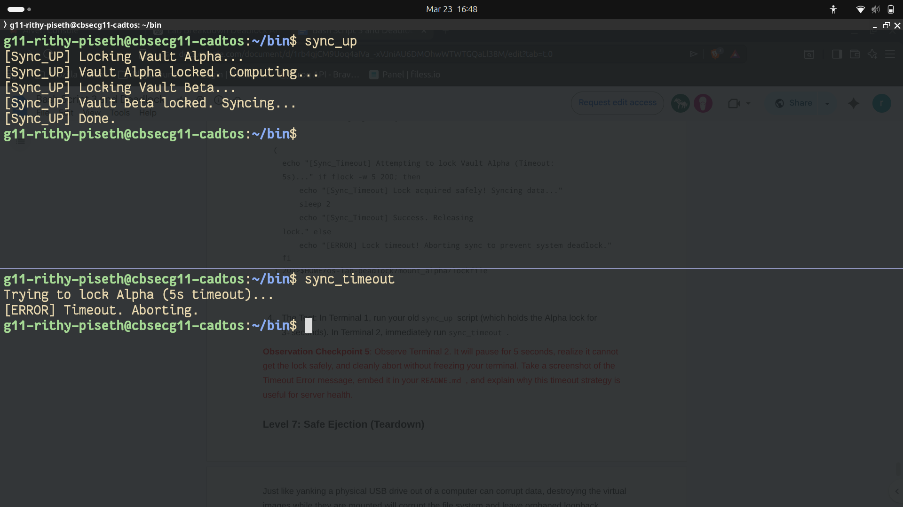
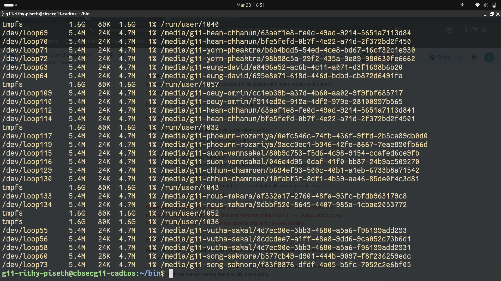

# os-lab-DEADLOCK-IDTB110326
### Observation Checkpoint 1 — Level 1
Command: df -h | grep loop

Screenshot:

Explanation:
The output shows /dev/loop50 and /dev/loop51 are successfully mounted at
/media/g11-rithy-piseth/4d148c68-c549-48ae-b183-357c64abe255 and /media/g11-rithy-piseth/9b9e1049-9b4c-4082-8810-4908e3a61996
respectively. This proves both virtual disk images have been attached to loopback
devices and recognized by the kernel as mounted file systems without root privileges.

---

## Observation Checkpoint 2 — Level 3
Command: ps aux | grep sync_

Screenshot 1 — ps aux Output:

Explanation:
sync_up held the Alpha lock and was waiting for Beta. sync_down held the Beta
lock and was waiting for Alpha. Neither script could proceed because each was
blocked by the other — a classic circular wait. Both processes hung indefinitely
and never reached "Sync complete."

---

## Observation Checkpoint 3 — Level 4
Screenshot — Frozen Terminal:

Explanation:
Both players were completely frozen simultaneously across two separate user accounts.
This simulates a distributed denial of service because the entire DR sync system
was rendered non-functional across multiple users — not just a single process —
requiring manual intervention to recover.

## Observation Checkpoint 4 — Level 5
**Screenshot:**

**Explanation:**
After patching `sync_up` and `cross_sync_Alpha` to acquire Alpha before Beta,
both scripts completed sequentially without freezing. Player A acquired Alpha
first, Player B queued safely behind, then Player A finished and released both
locks allowing Player B to proceed. The Circular Wait condition was broken
because both processes now request resources in the exact same global order —
making it impossible for each to hold what the other needs simultaneously.

---

## Observation Checkpoint 5 — Level 6
**Screenshot:**

**Explanation:**
Terminal 2 waited 5 seconds, failed to acquire the Alpha lock held by `sync_up`,
and cleanly aborted with the timeout error instead of freezing indefinitely.
This timeout strategy is useful for server health because it breaks the
No Preemption condition — the process voluntarily gives up and releases system
resources rather than hanging forever, allowing other processes to continue
and making the system self-recovering without administrator intervention.

---

## Observation Checkpoint 6 — Level 7
**Command:** `df -h | grep loop`

**Screenshot:**

**Explanation:**
The empty output proves both loopback devices were successfully unmounted and
detached from the kernel. Proper teardown is critical because destroying a
mounted image file corrupts the ext4 file system, and without `loop-delete`,
orphaned `/dev/loopX` entries remain in the kernel indefinitely wasting
resources and causing conflicts for other users on the shared server.
