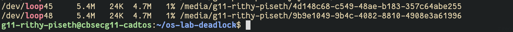
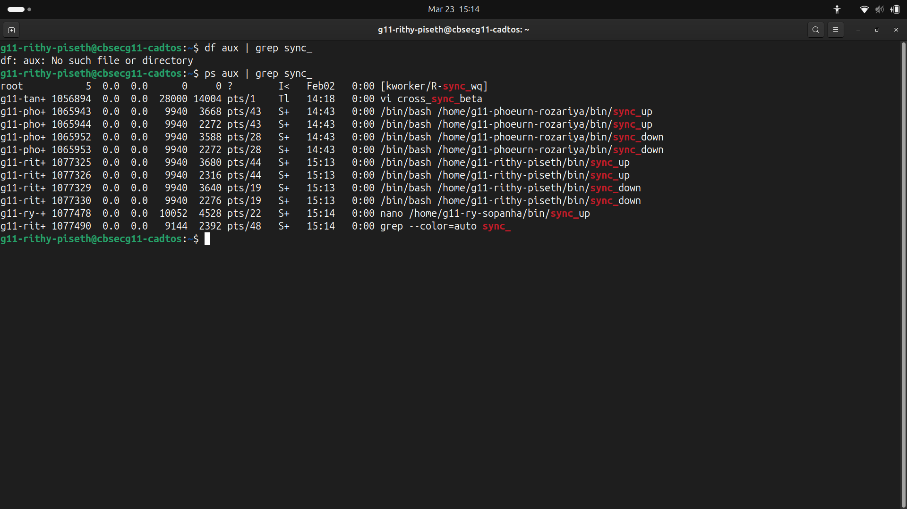
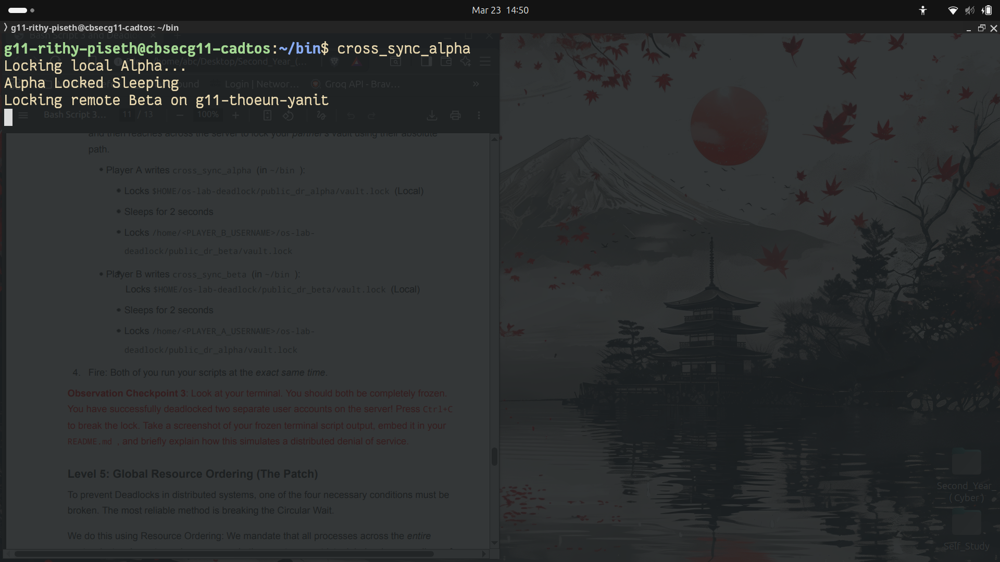

# os-lab-DEADLOCK-IDTB110326
### Observation Checkpoint 1 — Level 1
Command: df -h | grep loop

Screenshot:

Explanation:
The output shows /dev/loop50 and /dev/loop51 are successfully mounted at
/media/g11-rithy-piseth/4d148c68-c549-48ae-b183-357c64abe255 and /media/g11-rithy-piseth/9b9e1049-9b4c-4082-8810-4908e3a61996
respectively. This proves both virtual disk images have been attached to loopback
devices and recognized by the kernel as mounted file systems without root privileges.

---

## Observation Checkpoint 2 — Level 3
Command: ps aux | grep sync_

Screenshot 1 — ps aux Output:

Explanation:
sync_up held the Alpha lock and was waiting for Beta. sync_down held the Beta
lock and was waiting for Alpha. Neither script could proceed because each was
blocked by the other — a classic circular wait. Both processes hung indefinitely
and never reached "Sync complete."

---

## Observation Checkpoint 3 — Level 4
Screenshot — Frozen Terminal:

Explanation:
Both players were completely frozen simultaneously across two separate user accounts.
This simulates a distributed denial of service because the entire DR sync system
was rendered non-functional across multiple users — not just a single process —
requiring manual intervention to recover.
